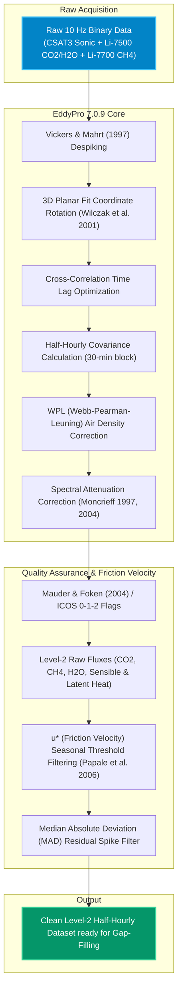

# Pipeline 01: Raw 10 Hz Micrometeorology to Clean Level-2 Fluxes

This pipeline processes high-frequency (10 Hz) turbulent fluctuations from the Campbell Scientific CSAT3 sonic anemometer and Li-7500 / Li-7700 open-path gas analyzers through EddyPro® into quality-filtered half-hourly fluxes.

### Key Statistical Parameters:
* **Sampling Rate:** 10 Hz (18,000 observations per 30-min block).
* **Friction Velocity Threshold ($u^*$):** Determined per 50-day moving window with bootstrapping ($100$ iterations).
* **Quality Screening:** Rejection of ICOS Flag 2 (steady-state test violation $>30\%$ or integral turbulence characteristics test failure).
