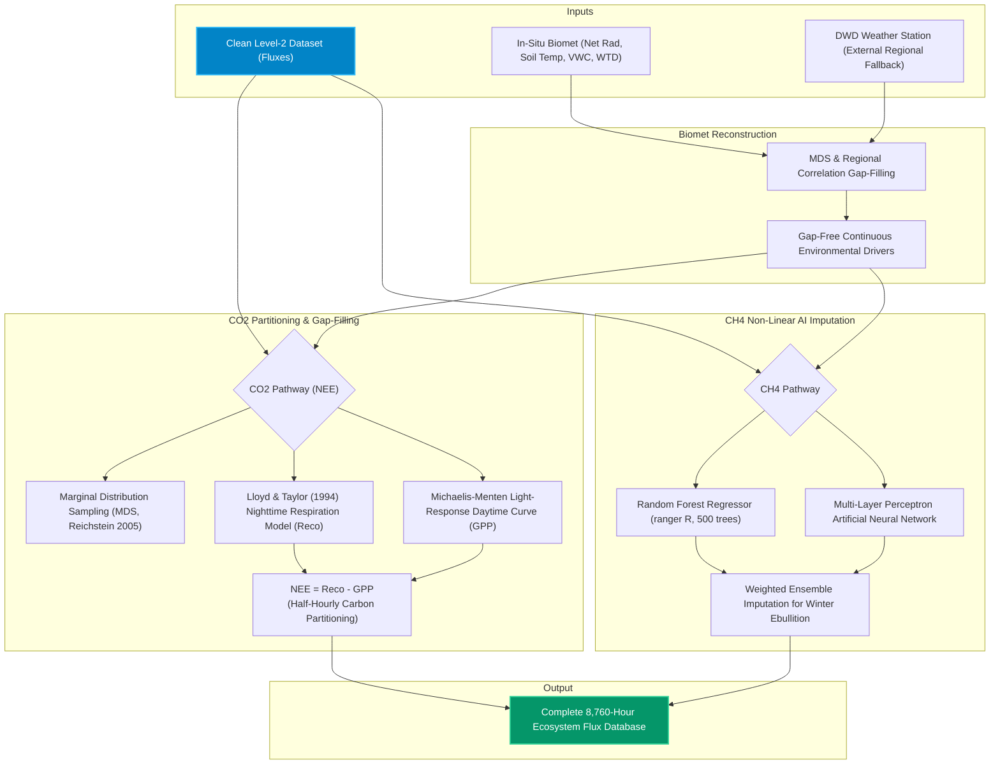

# Pipeline 02: Multi-Gas Imputation & Flux Partitioning

This pipeline handles gap-filling of meteorological drivers, carbon dioxide partitioning (NEE into GPP and Reco), and non-linear machine learning imputation of methane fluxes during winter data dropouts.

### Gap-Filling Strategy Highlights:
* **MDS Covariates:** Incoming Shortwave Radiation ($R_g$), Vapor Pressure Deficit (VPD), and Soil Temperature ($T_{soil, 5cm}$).
* **Methane AI Predictors:** Water Table Depth (WTD), Air Pressure ($P_{atm}$ for ebullition triggering), Soil Moisture ($VWC_{5cm}$), and Peat Soil Temperature at 20 cm.
