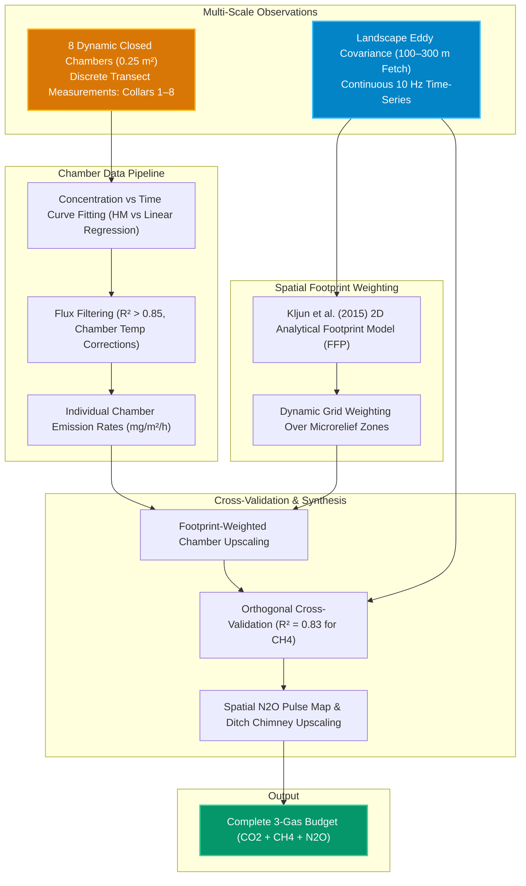

# Pipeline 03: Multi-Platform Scale Integration (Chambers & Eddy Covariance)

This pipeline integrates discrete soil-collar greenhouse gas chamber measurements with the landscape-scale footprint of the Eddy Covariance tower to cross-validate fluxes and account for microtopographic heterogeneity.

### Key Methodological Insights:
* **The Scale Disconnect:** Discrete chambers capture localized ditch ebullition hotspots and N₂O nitrification/denitrification pulses, which the tower averages over hundreds of meters.
* **Footprint Model:** Kljun FFP run half-hourly incorporating Obukhov length ($L$), standard deviation of lateral wind velocity ($\sigma_v$), and boundary layer height ($h$).
