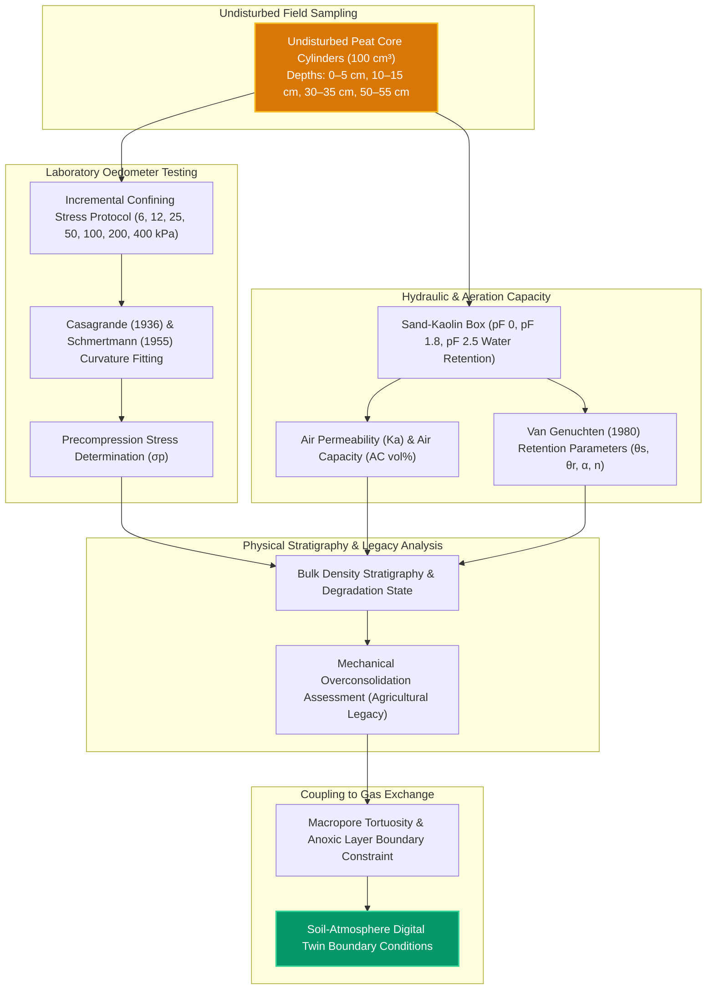

# Pipeline 04: Soil Physics, Precompression Stress & Geomechanics

This pipeline integrates undisturbed soil core oedometer testing, soil moisture retention curves (pF), bulk density stratification, and air permeability measurements across the degraded peat profile.

### Critical Geomechanical Quantifications:
* **Precompression Stress ($\sigma_p$):** $38.4 \pm 4.2\text{ kPa}$ in topsoil ($0\text{--}5\text{ cm}$) indicating heavy tractor wheel compaction during prior agricultural management.
* **Bulk Density ($\rho_b$):** Peaks at $0.38\text{ g/cm}^3$ in the compacted plow layer, severely reducing air permeability ($K_a < 1.2\text{ }\mu\text{m}^2$) and sealing methanotrophic bio-filters when water levels rise.
