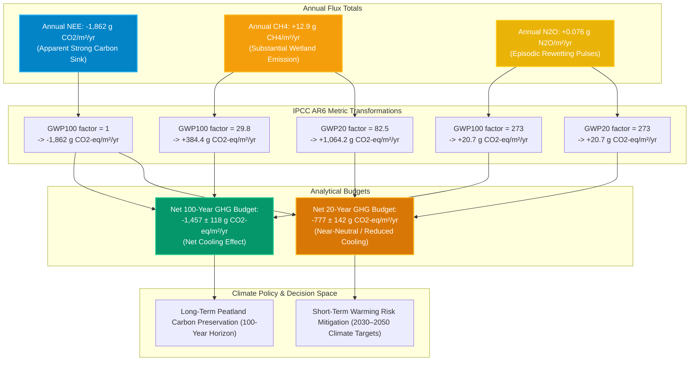

# Pipeline 05: Master Radiative Forcing & Multi-Gas GHG Budget

This pipeline executes the synthesis of carbon dioxide ($\text{CO}_2$), methane ($\text{CH}_4$), and nitrous oxide ($\text{N}_2\text{O}$) balances, applying Global Warming Potentials across multiple analytical time horizons ($\text{GWP}_{100}$, $\text{GWP}_{20}$, and Sustained-Flux $\text{SGWP}$).

### Climate Radiative Forcing Highlights:
* **The Horizon Divergence:** On a 100-year timescale, methane offsets only $20.6\%$ of the photosynthetic $\text{CO}_2$ drawdown. On a 20-year horizon, methane emissions offset over $57.1\%$ of the $\text{CO}_2$ sink.
* **Nitrous Oxide Contribution:** $\text{N}_2\text{O}$ emissions remain minor ($<2\%$ of total radiative forcing) but are critical indicators of rewetting aeration stress.
